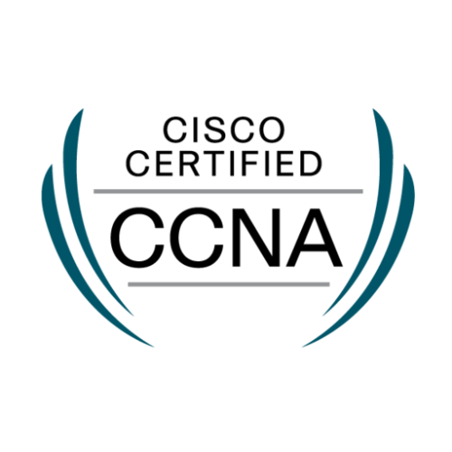
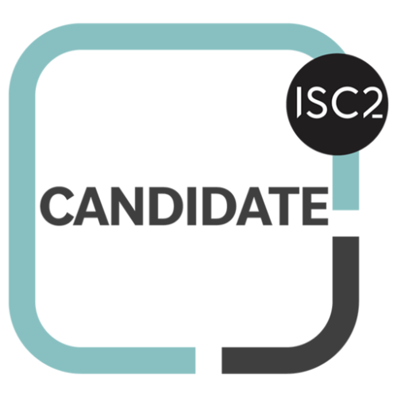
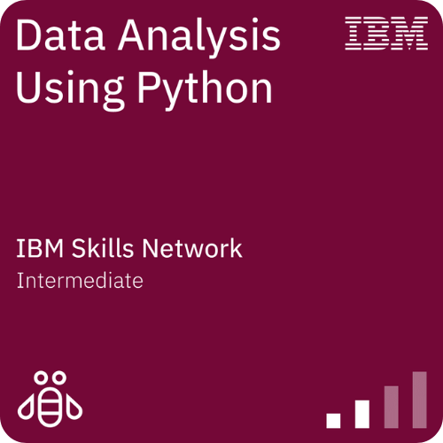
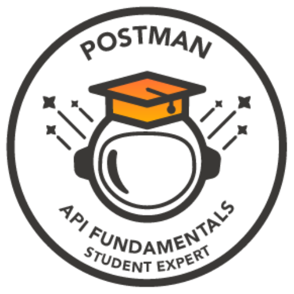

<h1 align="center" style="font-size: 2.5em; font-weight: bold;">
  👋 Hello, I'm Kunal Chaudhari! 
  😄
</h1>
<h3 align="center" style="font-size: 1.5em;">
  🔐 A passionate Cybersecurity Enthusiast  🚀
</h3>

 
 <h4>⚡ Currently pursuing a Bachelor's degree in Computer Engineering (B.E. Comps '25) and continuously exploring the latest tech trends.</h4>

 <h4>🌐 Engaged in diverse projects across cloud platforms like Azure, GCP, and AWS, combining my interests in AI, cloud engineering, and cybersecurity.</h4>

 <h4>🤖 A proud participant in hackathons and CTF challenges, constantly sharpening my problem-solving skills to make the digital world safer.</h4>

  <h4>📧 Contact me at: kunal.kc2003@gmail.com</h4>

 
  

 
  <a href="https://kc-codes.github.io/" target="_blank">
      <!-- sqlite, safari, google-chrome are other good icon options -->
  </a>

 

<h2 align="center">📦 My Technology and Frameworks ⚒️</h2>
 

  

  

  
  

 

<h2 align="center" style="font-size: 1.8em; margin-bottom: 10px;">
  🌟 About Me 🌟
   
</h2>

  Greetings, I am Kunal Chaudhari, where ambition, self-motivation, and a deep-seated passion for cybersecurity define my identity as a dedicated Cybersecurity Enthusiast. I am committed to continuous growth, driven by an unwavering curiosity for technology and an insatiable desire to enhance digital safety. My journey is marked by a focus on penetration testing, where I strive to identify and mitigate vulnerabilities in systems. Always eager to learn, I actively explore emerging trends in AI, cloud technologies, and networking, pushing the boundaries of what is possible in the realm of cybersecurity. 📈

 

<h3 align="center">Stats:</h3>

  

    

      
    

  

  

    

      
    

  

  
 

<h3 align="center">Statistics</h3>

<a href="https://github.com/kc-codes">

 

🪶 Certifications and Badges

<table align="center">
 <tr align="center">
   <td style="border-right: 1px solid #eeeeef;" align="center">
     
      
     <strong>CCNA</strong>
   </td>
   <td style="border-right: 1px solid #eeeeef;" align="center">
     
      
     <strong>Google Cybersecurity Professional </strong>
   </td>
   <td style="border-right: 1px solid #eeeeef;" align="center">
     
      
     <strong>Az-900</strong>
   </td>
   <td style="border-right: 1px solid #eeeeef;" align="center">
     
      
     <strong>Ai-900</strong>
   </td>
   </td>
 </tr>
</table>

<table align="center">
 <tr align="center">
   <td style="border-right: 1px solid #eeeeef;" align="center">
     
      
     <strong>Junior Cybersecurity Analyst</strong>
   </td>
   <td style="border-right: 1px solid #eeeeef;" align="center">
     
      
     <strong>ISC2 Candidate</strong>
   </td>
   <td align="center">
     
      
     <strong>Data Analysis Using Python</strong>
   </td>
   <td align="center">
     
      
     <strong>Postman</strong>
   </td>
 </tr>
</table>
 

 
